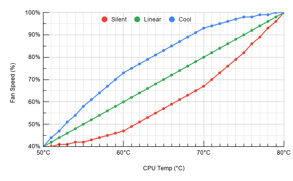

# RPi Fan Controller

 __WARNING!__ This test release is NOT ready for normal use and might potentially damage your board! This is the only warning you will be given! 

---

The project originally started off as a custom script written by Patrick Lineruth for the [NESPi-4 Fan Control](https://mini-mods.com/product/nespi-4-fan-control/) PCB,
but was later changed to be used with the official [Raspberry Pi 4 Case Fan](https://www.raspberrypi.org/products/raspberry-pi-4-case-fan/) instead.

The script will not only turn the fan on/off, but also adjust the fan speed according to the temperature using a fan curve.

## Installation

1. Go to the official website and follow the first 5 steps of the [Getting started](https://www.raspberrypi.org/products/raspberry-pi-4-case-fan/) section.
2. Install the fan controller python script:

   ```bash
   wget -O - "https://raw.githubusercontent.com/WaCrex/RPi_Fan_Controller/master/install.sh" | sudo bash
   ```

## Fan Profiles

The script comes with 3 fan profiles: Silent, Linear & Cool. With Linear being the default preset.



## Configuration

The python script is by default looking for a json-file with the same name as the python script, by default this should be fan_ctrl.json
fan_ctrl.json:

```json
{
    "profile": "linear",
    "gpio_pin": 14,
    "pwm_freq": 100,
    "profiles": {
        "silent": [
            40, 40, 41, 41, 42, 42, 43, 44,
            45, 46, 47, 49, 51, 53, 55, 57,
            59, 61, 63, 65, 67, 70, 73, 76,
            79, 82, 86, 89, 93, 96, 100],
        "linear": [
            40, 42, 44, 46, 48, 50, 52, 54,
            56, 58, 60, 62, 64, 66, 68, 70,
            72, 74, 76, 78, 80, 82, 84, 86,
            88, 90, 92, 94, 96, 98, 100],
        "cool": [
            40, 44, 47, 51, 54, 58, 61, 64,
            67, 70, 73, 75, 77, 79, 81, 83,
            85, 87, 89, 91, 93, 94, 95, 96,
            97, 98, 98, 99, 99, 100, 100]
    }
}
```

|Option|Default|Description|
|:-|:-|:-|
|`profile`|`linear`|*The name of the profile currently in use (must be listed under profiles)*|
|`gpio_pin`|`14`|*The GPIO Pin that the fan's PWM cable is connected to*|
|`pwm_freq`|`100`|*The frequency of the PWM signal*|
|`profiles`||*A dictionary of fan profiles, with Duty Cycle values (%) for the temperatures 50-80°C. The values must be between 0-100% and decimals aren't allowed*|
